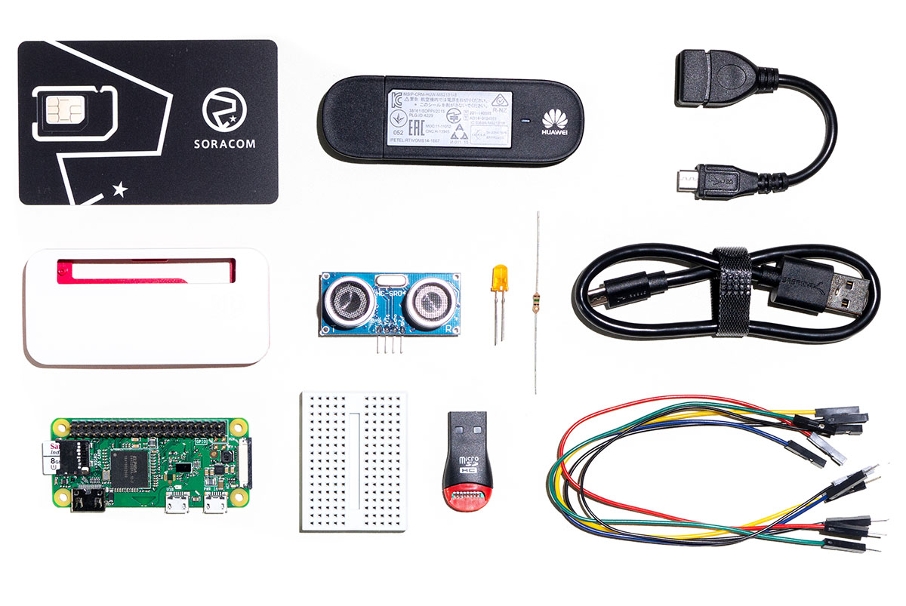

# SullySafe

We made a comparison between different IoT providers. We learned that Soracom Cloud  provides an updated Starter Kit. This made our decision a quick one since we wanted to make sure we can deliver a viable product for the sake of the competition. 

## List of Required Items: 

1. **Soracom Air IoT SIM Card** :The Soracom IoT SIM provides cellular data connectivity and SMS functionality on 2G, 3G, and 4G/LTE networks in 135 countries around the world, fully managed right from your browser on the Soracom User Console.

2. **Raspberry Pi Zero W and Official Case** :Super-small and easy-to-use, this tiny Linux computer supports a wide variety of programming environments to make developing your project a breeze, with a case to keep everything protected.
- Download: [Noobs](https://www.raspberrypi.org/downloads/noobs/)
- Download: [Noobs Link](https://downloads.raspberrypi.org/NOOBS_latest)

3. **Huawei 3G USB Modem (MS2131i) and USB OTG Adapter Cable** :A great modem that provides 2G and 3G cellular connectivity, designed especially for IoT projects, plus a USB OTG cable to hook it up to the Raspberry Pi.

4. **Ultrasonic Range Finder (HC-SR04)** :This simple yet reliable sensor measures distance using ultrasonic vibrations, and accurate up to 10 feet. We love this sensor because we can quickly capture data for easy visualization, just by waving our hand in front of it!

5. **16GB Micro-SD Card and Micro-SD Card Reader** :Storage for your Raspberry Pi, plus a card reader so you can edit its contents on your computer.

6. **Perma-Proto Breadboard and Color-coded Wires** :For connecting the Ultrasonic Range Finder to your Raspberry Pi, without soldering anything.

7. **LED and 15-Ohm resistor** :Basic hardware for testing signal output.

8. **USB-A to Micro-USB Cable** :To power your Raspberry Pi from your computer or other USB power source.

- Download: [Powershell](https://docs.microsoft.com/en-us/powershell/scripting/install/installing-powershell?view=powershell-7)

# Quickstart 

Main GPS API: 
- GpsController(): Create controller 
- start(): Starts controller 
- fix.latitude: Reads latitude 
- fix.longitude: Reads longitude 
- stopController(): Stops controller 

